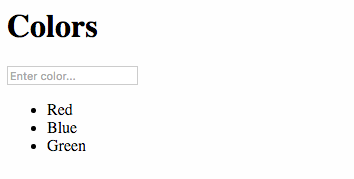

# Create some Colors

To demonstrate the built-in CRUD behaviors in Lore, we're going to add an input box to our application so we can 
create new colors.  Modify you're `Home` and `Color` components one more time to look like this:

```js
// src/components/Home.js
var React = require('react');
var Color = require('./Color');

var ENTER_KEY = 13;

module.exports = lore.connect(function(getState, props) {
    return {
      colors: getState('color.all', {
        where: { }
      })
    }
  },
  React.createClass({
    displayName: 'Home',

    getInitialState: function () {
      return {
        newColor: ''
      };
    },

    propTypes: {
      colors: React.PropTypes.object.isRequired
    },

    onChangeNewColor: function (event) {
      this.setState({
        newColor: event.target.value
      });
      console.log(event.target.value);
    },

    onKeyDownNewColor: function (event) {
      if (event.charCode !== ENTER_KEY) {
        return;
      }

      var value = this.state.newColor.trim();

      if (value) {
        lore.actions.color.create({
          name: value
        });

        this.setState({
          newColor: ''
        });
      }
    },

    renderColor: function(color) {
      return (
        <Color key={color.id || color.cid} color={color} />
      );
    },

    render: function() {
      var colors = this.props.colors;

      return (
        <div>
          <h1>Colors</h1>
          <input
            placeholder="Enter color..."
            value={this.state.newColor}
            onKeyPress={this.onKeyDownNewColor}
            onChange={this.onChangeNewColor} />
          <ul>
            {colors.data.map(this.renderColor)}
          </ul>
        </div>
      );
    }

  })
);
```

```js
// src/components/Color.js
var React = require('react');

module.exports = React.createClass({
  displayName: 'Color',

  propTypes: {
    color: React.PropTypes.object.isRequired
  },

  render: function() {
    var color = this.props.color;
    return (
      <li>{color.data.name}</li>
    );
  }
});
```

With this code in place, you should see an input box in the application.  Type a color into the box and hit enter, and 
you should see it appear in the list below.



## What's going on?

**TODO**: Talk about the important callouts, being the new data structure (data, error, state) and `lore.actions`.

## Next Steps

Next we're going to add the ability [to delete colors](./DeleteColors.md).
