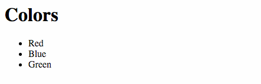

# Creating Components

**TODO**: Use part of this example to highlight the `lore generate component [component_name]` generator.

For this example, we're going to create a simple app that shows a list of colors.  We'll start off by creating the 
static representation of the application, and then refactor to connect it to a data source so we can support adding 
and deleting colors.

First, replace the contents of `src/components/Home.js` with the following code:

```js
// src/components/Home.js
var React = require('react');

module.exports = React.createClass({
  displayName: 'Home',

  render: function() {
    return (
      <div>
        <h1>Colors</h1>
        <ul>
          <li>Red</li>
          <li>Blue</li>
          <li>Green</li>
        </ul>
      </div>
    );
  }
});
```

You application should now look like this:



### Hot Reloading
**TODO**: Figure out why hot-reloading isn't working, then fix it and update this docs to highlight that feature.

### Refactor

Next we're going to refactor our component to prepare to connect it to a data-source. When you're generating a dynamic
list in React, it's a good pattern to make each list item its own component.  This makes it easier to respond to click
events, or detect which item you want to update to delete.  So that's what we're going to do.

First, create a new `Color` component at `src/components/Color.js` and past the following code inside. 

```js
// src/components/Color.js
var React = require('react');

module.exports = React.createClass({
  displayName: 'Color',

  propTypes: {
    name: React.PropTypes.string.isRequired
  },

  render: function() {
    return (
      <li>{this.props.name}</li>
    );
  }
});
```

Next, update `src/components/Home.js` to use the `Color` component. For now, we're going to hard-code our colors as an
array of strings, but we'll be replacing that with data form a real data-source soon.

```js
// src/components/Home.js
var React = require('react');
var Color = require('./Color');

module.exports = React.createClass({
  displayName: 'Home',

  renderColor: function(color) {
    return (
      <Color key={color} name={color} />
    );
  },

  render: function() {
    var colors = [
      'Red',
      'Blue',
      'Green'
    ];

    return (
      <div>
        <h1>Colors</h1>
        <ul>
          {colors.map(this.renderColor)}
        </ul>
      </div>
    );
  }
});

```

With those components created, refresh the browser to verify that app displays correctly.

## Next Steps

Next we're going to [create a Model](./CreatingModels.md) to store our colors.
