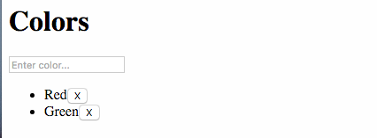

# Create some Colors

Now that we can create data, let's delete it. Deleting data in Lore is pretty straight forward. You just need to 
call the appropriate action and pass in the resource you want to delete. For this example we're going to add a button
to each line item, and delete the data when that button is clicked.

Update your `Color` component to look like this:

```js
// src/components/Color.js
var React = require('react');

module.exports = React.createClass({
  displayName: 'Color',

  propTypes: {
    color: React.PropTypes.object.isRequired
  },

  onDestroy: function() {
    lore.actions.color.destroy(this.props.color);
  },

  render: function() {
    var color = this.props.color;

    return (
      <li>
        {color.data.name}
        <button onClick={this.onDestroy}>X</button>
      </li>
    );
  }
});
```

With this code in place, your application should now look like this, displaying a button next to each line item: 



## Next Steps

Next we're going to add the ability [to delete colors](./DeleteColors.md).
