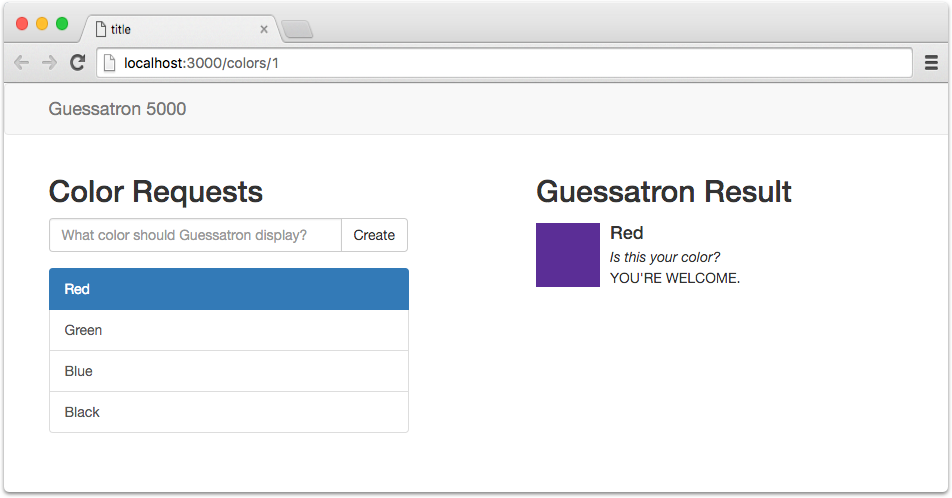

# Basics

Welcome to the Lore tutorial.  This will walk you through the basics of using Lore with a step-by-step guide you can 
follow along with.  You can also watch a video of the tutorial below.

https://www.youtube.com/watch?v=xsSnOQynTHs

This is the application we'll be building:

The tutorial will be broken up into two parts.  The first will demonstrate the following features:

1. Creating a new project
2. Connecting components to your data store
3. Creating data
4. Routing

The second part of the tutorial will expand on part 1 and demonstrate:

1. Deleting data
2. Launching modal dialogs
3. Editing data
4. Detecting and communicating state changes (how to know when data is being created, or a GET request returns a 
404 NOT FOUND from the server)

**NOTE** Lore is NOT a replacement or alternative to Redux.  It is build **on top** of Redux and is merely a set of 
conventions and utilities to make developing React/Redux applications faster. The more comfortable you are with Redux, 
the less magical Lore will seem. Lore is intended to reduce the learning curve for React/Redux development, by applying
reasonable conventions around the smaller pieces (Webpack, Redux, React-Router, publishing). Also, most of Lore's magic
relies on the assumption that the API(s) your application is using follow certain conventions, mainly that they're 
a) flat, and b) behave consistently, similar data structures, etc. Much of the complexity in UI development comes from
the API.  The more difficult and inconsitent the API is, the more you'll need to understand Redux, and more parts of
Lore you will need to override.

## Next Steps

Start the [tutorial](./Step0a.md).
