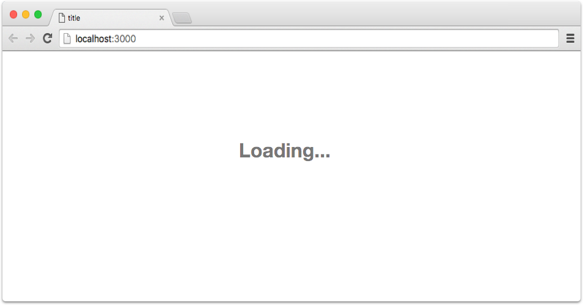

# Step 0c: Orientation

At the root of your project you should see an `index.html` file.  This file is what gets served to the browser, and
should currently look like this:

```html
<html>
  <head>
    <title>New Lore App</title>
    <style>
      .loading-text {
        text-align: center;
        line-height: 100vh;
        font-size: 32px;
        margin: 0;
        font-weight: bold;
        color: rgba(0,0,0,.54);
      }
    </style>
  </head>
  <body>
    <div id="root">
      <h1 class="loading-text">
        Loading...
      </h1>
    </div>
    <div id="dialog"></div>

    <script src="/dist/bundle.js"></script>
  </body>
</html>
```

### Loading Screen

The `#root` element is where our application is going to be attached. The default `<style>` tag and `.loading-text` 
element are there to serve as minimalistic splash screen while the browser fetches the JavaScript files. It's intended
to be a more meaningful alternative to the standard blank white page.  The loading screen will look like this:




### Options for Following Along  
>This tutorial provides two different options for following along. 

>For the first option, each step will call-out the required file changes, and you can make them yourself if you'd like.  

>For the second option, the `lore-cli` has the ability to automatically make the file changes for you.  For example, 
since this "step1" in the tutorial, if you run the command `lore generate:tutorial step1` the CLI will add any missing
files and modify existing files to update your project to reflect the state of "step 1".


## Next Steps

Next that we've done some orientation, let's start by modifying our `index.html` file to [add some styling](./Step1.md)
to our project so that it's more attractive while we work on it.
