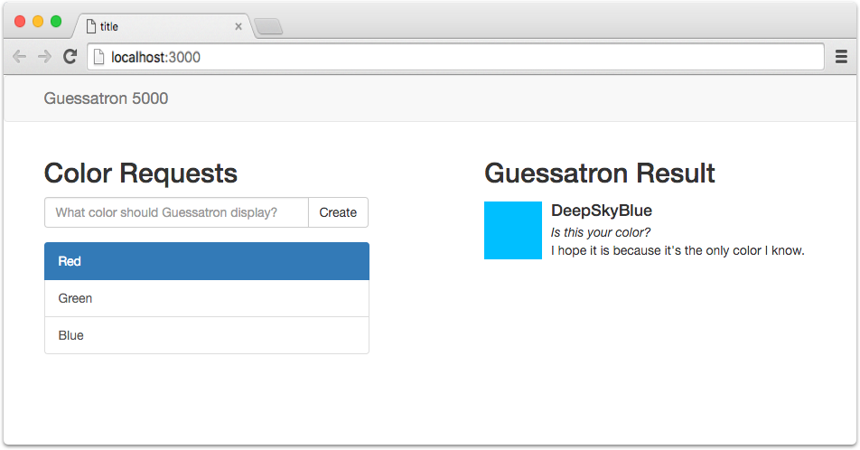
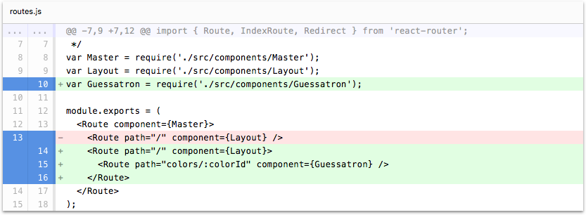
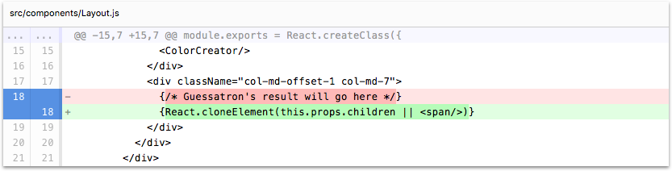
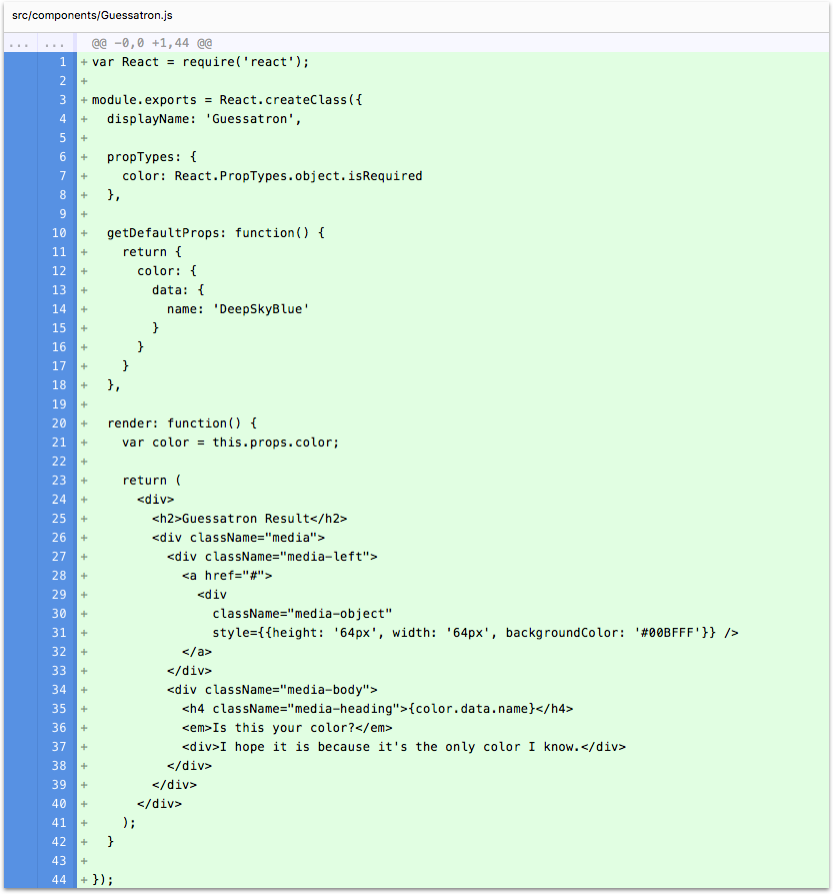

# Step 11: Build the Guessatron

In this step we're going to start building the Guesstron, and give our app something to show in the right column
to demonsrate that our routing is working.

If you're using the CLI to follow along, you can complete this step by running the following command:

```sh
lore generate:tutorial step11
```

### Add the Guessatron

First, we're going to create a component called `Guessatron`. You can do this either by copy/pasting, or by using the
CLI to run `lore generate:component Guessatron` from the command line.  Modify the file to look like this:

```js
var React = require('react');

module.exports = React.createClass({
  displayName: 'Guessatron',

  propTypes: {
    color: React.PropTypes.object.isRequired
  },

  getDefaultProps: function() {
    return {
      color: {
        data: {
          name: 'DeepSkyBlue'
        }
      }
    }
  },

  render: function() {
    var color = this.props.color;

    return (
      <div>
        <h2>Guessatron Result</h2>
        <div className="media">
          <div className="media-left">
            <a href="#">
              <div
                className="media-object"
                style={{height: '64px', width: '64px', backgroundColor: '#00BFFF'}} />
            </a>
          </div>
          <div className="media-body">
            <h4 className="media-heading">{color.data.name}</h4>
            <em>Is this your color?</em>
            <div>I hope it is because it's the only color I know.</div>
          </div>
        </div>
      </div>
    );
  }
});
```

For now, our Guessatron component will simply take a color as property, and render some mostly static content. However,
since we don't know how to tell Guessatron what color to display yet, we'll just hardcode a nice color in 
`getDefaultProps`.

### Add the Guessatron to routes.js

Now that we've created the Guessatron, we need to tell our `routes.js` file about it, and let it know which URL it
should be rendered for.

The behavior we want is that whenever the user clicks on a color, the route should change from `localhost:3000` to
`localhost:3000/colors/:id`, where `:id` is the id of that color. The right column them should show the Guessatron
component, which will then display the name of that color. To get this behavior, we're going to require the 
`Guessatron` component in `routes.js` and modify the routes to look like this:

```js
// routes.js
...
var Guessatron = require('./src/components/Guessatron');

module.exports = (
  <Route component={Master}>
    <Route path="/" component={Layout}>
      <Route path="colors/:colorId" component={Guessatron} />
    </Route>
  </Route>
);
```

### Update Layout to 

At this point, if you refresh your browser and try clicking on color, the routes will change, and you won't see any
errors or warnings. But you also won't see the Guessatron in the right column. The reason for this is because we
haven't told our Layout that is should render children that it's provided by react-router.

To fix this, locate this line in the `render` function of `Layout`:

```js
// src/components/Layout.js
<div className="col-md-offset-1 col-md-7">
  {/* Guessatron's result will go here */}
</div>
```

Now replace the comment with `React.cloneElement(this.props.children || <span/>)` like this:

```js
// src/components/Layout.js
<div className="col-md-offset-1 col-md-7">
  {React.cloneElement(this.props.children || <span/>)}
</div>
```

With this change, the Guessatron will show up in the right column.  Yay!

### Visual Check-in

If everything went well, your application should now look like this. Now as you click on a color, the Guessatron
should be rendered in the right column. If you click on the "Guessatron 5000" title in the Header, the route should
reset to the root and the Guessatron should disappear.



## Code Changes

Below is a list of files modified during this step, as well as a visual diff to show you what was added or removed 
between this step and the last one.

### routes.js





```js
import React from 'react';
import { Route, IndexRoute, Redirect } from 'react-router';

/**
 * Routes are used to declare your view hierarchy
 * See: https://github.com/rackt/react-router/blob/master/docs/API.md
 */
var Master = require('./src/components/Master');
var Layout = require('./src/components/Layout');
var Guessatron = require('./src/components/Guessatron');

module.exports = (
  <Route component={Master}>
    <Route path="/" component={Layout}>
      <Route path="colors/:colorId" component={Guessatron} />
    </Route>
  </Route>
);
```


### src/components/Layout.js





```js
var React = require('react');
var Header = require('./Header');
var ColorCreator = require('./ColorCreator');

module.exports = React.createClass({
  displayName: 'Layout',

  render: function() {
    return (
      <div>
        <Header />
        <div className="container">
          <div className="row">
            <div className="col-md-4">
              <ColorCreator/>
            </div>
            <div className="col-md-offset-1 col-md-7">
              {React.cloneElement(this.props.children || <span/>)}
            </div>
          </div>
        </div>
      </div>
    );
  }
});
```


### src/components/Guessatron.js





```js
var React = require('react');

module.exports = React.createClass({
  displayName: 'Guessatron',

  propTypes: {
    color: React.PropTypes.object.isRequired
  },

  getDefaultProps: function() {
    return {
      color: {
        data: {
          name: 'DeepSkyBlue'
        }
      }
    }
  },

  render: function() {
    var color = this.props.color;

    return (
      <div>
        <h2>Guessatron Result</h2>
        <div className="media">
          <div className="media-left">
            <a href="#">
              <div
                className="media-object"
                style={{height: '64px', width: '64px', backgroundColor: '#00BFFF'}} />
            </a>
          </div>
          <div className="media-body">
            <h4 className="media-heading">{color.data.name}</h4>
            <em>Is this your color?</em>
            <div>I hope it is because it's the only color I know.</div>
          </div>
        </div>
      </div>
    );
  }
});
```


## Next Steps

Next we're going to show how the Guessatron component can obtain the [color specified in the URL](./Step12.md).
