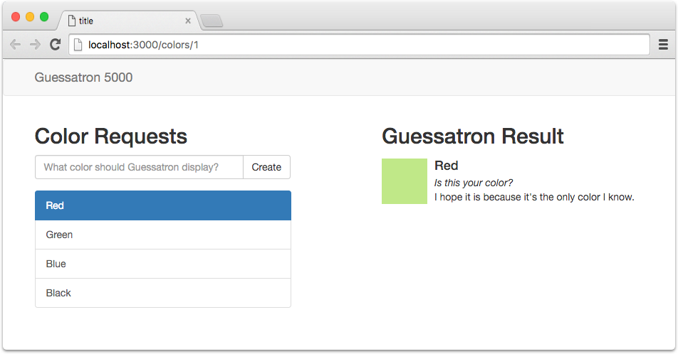
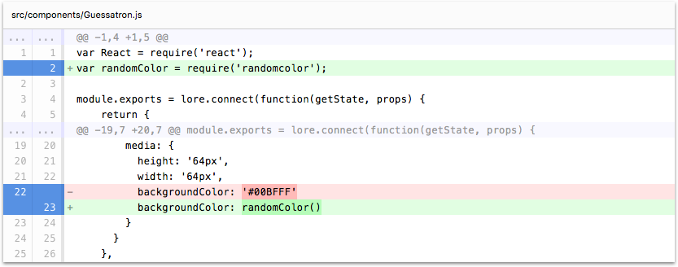

# Step 13: Color Recognition AI

In this step we're going to give the Guessatron the ability to recognize colors.

If you're using the CLI to follow along, you can complete this step by running the following commands:

```sh
npm install randomcolor --save
lore generate:tutorial step13
```

### Change the Color Displayed

Right now, the color the Guessatron displays is hardcoded, and that's no fun. So let's give him some artificial 
intelligence. First we're going to need to download his brain, so run this from the command line:
 
```sh
npm install randomcolor --save
```

[randomColor](https://github.com/davidmerfield/randomColor) is an npm package that displays attractive colors. With
that package installed, require it into `Guessatron` and update your render function to use it like this:

```js
// src/components/Guessatron.js
var randomColor = require('randomcolor');
...

render: function() {
  var color = this.props.color;
  var generatedColor = randomColor();
  
  return (
    ...
      <div className="media-object"
           style={{height: '64px', width: '64px', backgroundColor: generatedColor}} />
    ...
  );
}
```

### Visual Check-in

If everything went well, your application should now look like this. Check it out! Now when you click on a color, 
Guessatron updates the color of the box to reflect it. We should give Guessatron a voice so it can let you know how 
awesome it is.



## Code Changes

Below is a list of files modified during this step, as well as a visual diff to show you what was added or removed 
between this step and the last one.

### src/components/Guessatron.js





```js
var React = require('react');
var randomColor = require('randomcolor');

module.exports = lore.connect(function(getState, props) {
    return {
      color: getState('color.byId', {
        id: props.params.colorId
      })
    }
  },
  React.createClass({
    displayName: 'Guessatron',

    propTypes: {
      color: React.PropTypes.object.isRequired
    },

    render: function() {
      var color = this.props.color;
      var generatedColor = randomColor();

      return (
        <div>
          <h2>Guessatron Result</h2>
          <div className="media">
            <div className="media-left">
              <a href="#">
                <div
                  className="media-object"
                  style={{height: '64px', width: '64px', backgroundColor: generatedColor}} />
              </a>
            </div>
            <div className="media-body">
              <h4 className="media-heading">{color.data.name}</h4>
              <em>Is this your color?</em>
              <div>I hope it is because it's the only color I know.</div>
            </div>
          </div>
        </div>
      );
    }
  })
);
```


## Next Steps

Next we're going to [give Guessatron a voice](./Step14.md) so it can let you know how awesome it is.
