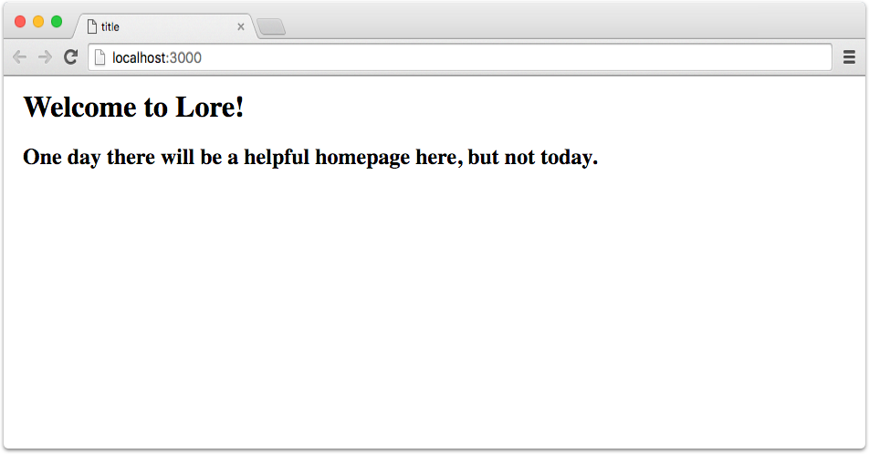

# Creating A New Project

To create a new Lore app, type `lore new` into the command line followed the name of your application. For this example
we are going to call our application `lore-tutorial`.

#### Create a new app

```sh
$ lore new lore-tutorial
```

This will create a new directory called `lore-tutorial`, and place all the necessary files inside. You should see 
a list of files created as the task completes.


```sh
...
|-> Generated file: ./config/env/development.js
|-> Generated file: ./gulp/tasks/default.js
|-> Generated file: ./config/reducerActionMap.js
|-> Generated file: ./initializers/REAMDE.md
|-> Generated file: ./gulp/tasks/README.md
|-> Generated file: ./package.json
|-> Generated file: ./config/env/README.md
|-> Generated file: ./README.md
|-> Generated file: ./config/reducerBlueprints.js
$
```

#### Install Dependencies

Once the project is created, navigate into the directory and install the dependencies.

```sh
$ cd lore-tutorial
$ npm install
```

#### Start the application

Once all the dependencies have been installed, you can start the app by running `npm start`.

```sh
$ npm start
```

This step kicks off Webpack and builds the project.  A successful execution should produce output similar to this:

```sh
  [420] ./~/lore/lib/Hook.js 286 bytes {0} [built]
  [421] ./~/lore/lib/app/getInitializers.js 217 bytes {0} [built]
  [422] ./~/lore/lib/app/sortHooksByLoadOrder.js 878 bytes {0} [built]
  [423] ./~/lore/~/topsort/lib/topsort.js 3.17 kB {0} [built]
  [424] ./~/lore/lib/app/getConfig.js 469 bytes {0} [built]

webpack: bundle is now VALID.
```

#### View app

At this point the application is built, and you can view it by navigating to `http://localhost:3000` in your 
browser.  You should see this:



#### Note
If you are using Chrome and you see this error in the network requests you can safely ignore it.  It is 
[a bug in Chrome](https://github.com/google/web-starter-kit/issues/807) that will be fixed in Chrome 50.

```sh
GET http://localhost:3000/service-worker.js net::ERR_INVALID_RESPONSE
```

## Next Steps

Next we're going to do some [quick orientation](./Step0c.md) and then dive into making the project.
