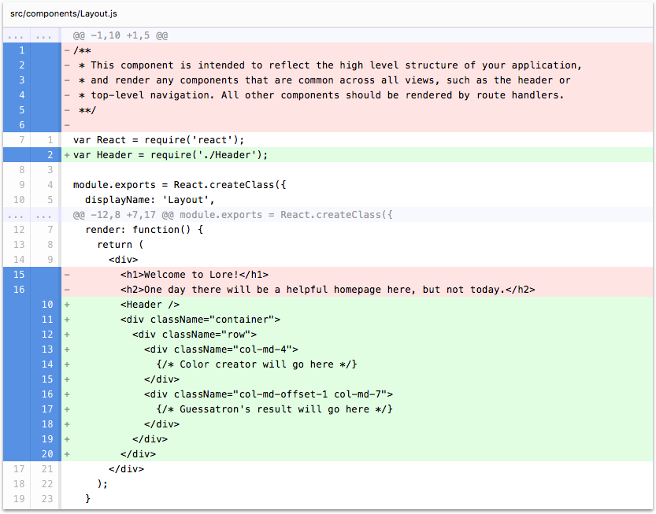

# Orientation / Options for Following Along

This tutorial provides two different options for following along. 

### Option 1: Manually Modify Files

For the first option, each step will call-out the required file changes, and you can make them yourself if you'd like.
At the end of each tutorial step you will also find a list of all files changed, as well as a diff of the file before 
and after the step, and a tab containing the full source code for that file. Here is an example:





```js
var React = require('react');
var Header = require('./Header');

module.exports = React.createClass({
  displayName: 'Layout',

  render: function() {
    return (
      <div>
        <Header />
        <div className="container">
          <div className="row">
            <div className="col-md-4">
              {/* Color creator will go here */}
            </div>
            <div className="col-md-offset-1 col-md-7">
              {/* Guessatron's result will go here */}
            </div>
          </div>
        </div>
      </div>
    );
  }
});
```


### Option 2: Using the CLI

For the second option, the `lore-cli` has the ability to automatically make the file changes for you.  For example, 
if you run the command `lore generate:tutorial step1` the CLI will add or modify any files required for "step 1" of the
tutorial. You will find the matching CLI command at the beginning of each step. They will look like this:

```sh
lore generate:tutorial step1
```

## Next Steps

Next that we've done some orientation, let's start by modifying our `index.html` file to [add some styling](./Step1.md)
to our project so that it's more attractive while we work on it.
