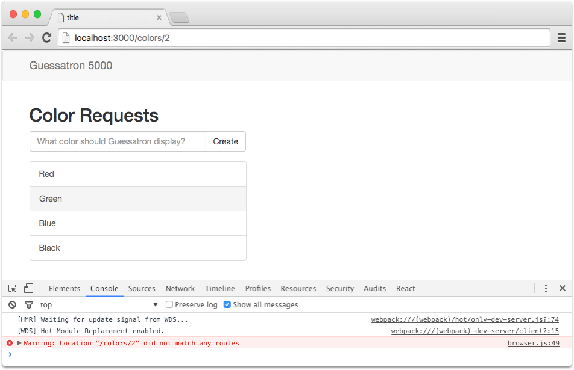
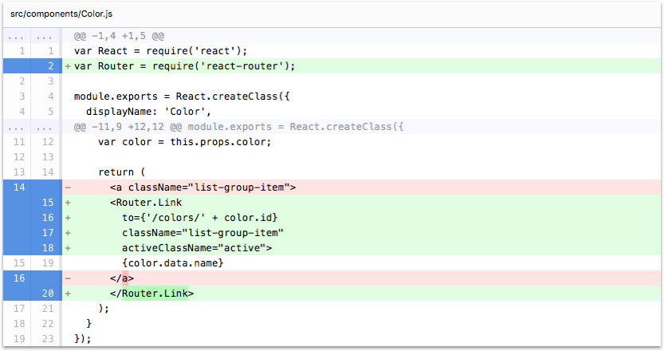
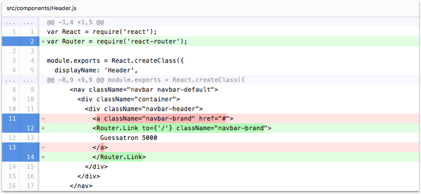

# Step 10: Add Routing

In this step we're going to integrate routing into our application.

If you're using the CLI to follow along, you can complete this step by running the following command:

```sh
lore generate:tutorial step10
```

### Lore uses React Router

Lore uses [react-router](https://github.com/reactjs/react-router) for navigation. This shows up in two places. The
first is in `routes.js` at the root of your project. This file is where you will import your components and describe
the route hierarchy for your application. We'll be touching on that more later in the tutorial.

The second place react-router shows up is in `config/router.js`. This file is where you can change the type of your 
router, which will typically be either "browser history" (push-state), which will allow your application to have clean 
URLs like `localhost:3000/colors/1`, or "hash history", which will create URLs like `localhost:3000/#/colors/1`. 

Lore defaults to "browser history" in order to promote clean URLs, but you won't always be able to use that routing 
style. If you're deploying your app to [GitHub Pages](https://pages.github.com) for example, you'll have to use 
"hash history" as GitHub doesn't support push-state. But if you deploy your app to [surge.sh](https://surge.sh) you 
can keep the default "browser history".

### Refactor Color to use React Router

Now that we've touched on react-router, let's modify any components that currently have hyperlinks to use it. First up
is `Color`. The `render` method of `Color` currently return this:

```js
// src/components/Color.js
return (
  <a className="list-group-item">
    {color.data.name}
  </a>
);
```

To use react-router, we're going to require it in the component, and switch the `<a>` tag to be `<Router.Link>`. This
is the code you'll need to add:

```js
// src/components/Color.js
var Router = require('react-router');
...
  return (
    <Router.Link
      to={'/colors/' + color.id}
      className="list-group-item"
      activeClassName="active">
      {color.data.name}
    </Router.Link>
  );
...
```
 
### Refactor Header to use React Router

The second and last component we need to modify is `Header`. Locate this link in the `render` function of `Header`:

```js
// src/components/Header.js
return (
  ...
  <a className="navbar-brand" href="#">
    Guessatron 5000
  </a>
  ...
);
```

Once again you're going to require react-router, and replace the `<a>` tag with `<Router.Link>` like so:

```js
// src/components/Header.js
return (
  ...
  <Router.Link to={'/'} className="navbar-brand">
    Guessatron 5000
  </Router.Link>
  ...
);
```

### Visual Check-in

If everything went well, your application should still look like this. Nothing has changed visually, but if you click
on any of the colors now, the route URL should update to something like `localhost:3000/colors/12`. If you have the
developer tools open, you'll also see an error in the console. We'll be addressing that in the next step.



## Code Changes

Below is a list of files modified during this step, as well as a visual diff to show you what was added or removed 
between this step and the last one.

### src/components/Color.js





```js
var React = require('react');
var Router = require('react-router');

module.exports = React.createClass({
  displayName: 'Color',

  propTypes: {
    color: React.PropTypes.object.isRequired
  },

  render: function () {
    var color = this.props.color;

    return (
      <Router.Link
        to={'/colors/' + color.id}
        className="list-group-item"
        activeClassName="active">
        {color.data.name}
      </Router.Link>
    );
  }
});
```


### src/components/Header.js





```js
var React = require('react');
var Router = require('react-router');

module.exports = React.createClass({
  displayName: 'Header',

  render: function () {
    return (
      <nav className="navbar navbar-default navbar-static-top">
        <div className="container">
          <div className="navbar-header">
            <Router.Link to={'/'} className="navbar-brand">
              Guessatron 5000
            </Router.Link>
          </div>
        </div>
      </nav>
    );
  }
});
```


## Next Steps

Next we're going to start building the Guessatron, and give our app [something to show when the route changes](./Step11.md).
