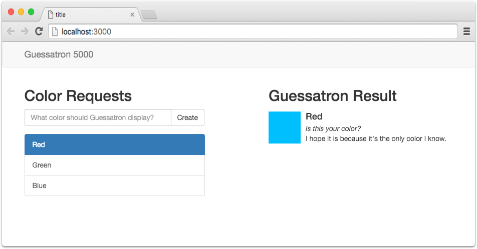
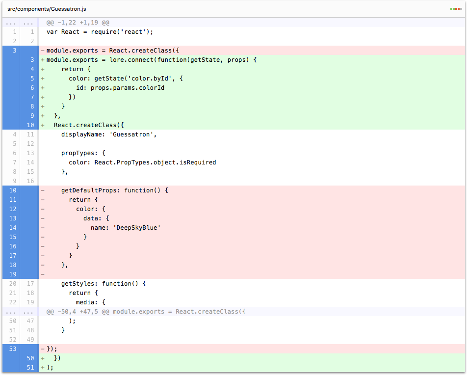

# Step 12: Connect the Guessatron

In this step we're going to show how the Guessatron component can request the color specified in the URL. 

If you're using the CLI to follow along, you can complete this step by running the following command:

```sh
lore generate:tutorial step12
```

### Connect the Guessatron

Since the Guessatron needs data, and the data it needs isn't provided by a parent component through props, the first
step we need to do is `connect` the Guessatron. Just like the `ColorCreator` component, we're going to wrap Guessatron 
with the `lore.connect` decorator. Modify the Guessatron to look like this:

```js
// src/components/Guessatron.js
var React = require('react');

module.exports = lore.connect(function(getState, props) {
    return {
      color: getState(`???`)
    }
  },
  React.createClass({
    // existing component code stays here
  })
);
```

Now when we connected the `ColorCreator` component we used `getState('color.find')` to get a list of all the colors.
But that's not what we want this time.  This time, we only want the color that has the `id` specified by the `:colorId`
parameter in our route.

To address this, update your `getState` call to look like this:

```js
// src/components/Guessatron.js
return {
  color: getState('color.byId', {
    id: props.params.colorId
  })
}
```

This time the piece of reducer state we're interested in is `color.byId`, which is a dictionary of all colors, using
their id as the key. This particular call also wants a second argument, which is the id of the color we're interested
in. This can be obtained from `props.params.colorId`. `params` is something react-router passed in, and `colorId` is
the name we called our route parameter in `routes.js`. 

As this point you can go ahead and remove the `getDefaultProps` function from our component, as we no longer need to 
hardcode any data.

```js
// src/components/Guessatron.js
// remove the 'getDefaultProps' function
getDefaultProps: function() {
  return {
    color: {
      data: {
        name: 'DeepSkyBlue'
      }
    }
  }
},
```

### Visual Check-in

If everything went well, your application should look like this. Now as you click on colors, the Guessatron should
change the name of the color to match what you clicked on!



## Code Changes

Below is a list of files modified during this step, as well as a visual diff to show you what was added or removed 
between this step and the last one.

### src/components/Guessatron.js





```js
var React = require('react');

module.exports = lore.connect(function(getState, props) {
    return {
      color: getState('color.byId', {
        id: props.params.colorId
      })
    }
  },
  React.createClass({
    displayName: 'Guessatron',

    propTypes: {
      color: React.PropTypes.object.isRequired
    },

    getStyles: function() {
      return {
        media: {
          height: '64px',
          width: '64px',
          backgroundColor: '#00BFFF'
        }
      }
    },

    render: function() {
      var color = this.props.color;
      var styles = this.getStyles();

      return (
        <div>
          <h2>Guessatron Result</h2>
          <div className="media">
            <div className="media-left">
              <a href="#">
                <div className="media-object" style={styles.media} />
              </a>
            </div>
            <div className="media-body">
              <h4 className="media-heading">{color.data.name}</h4>
              <em>Is this your color?</em>
              <div>I hope it is because it's the only color I know.</div>
            </div>
          </div>
        </div>
      );
    }
  })
);
```


## Next Steps

Next we're going to give our Guessatron [some artificial intelligence](./Step13.md).
