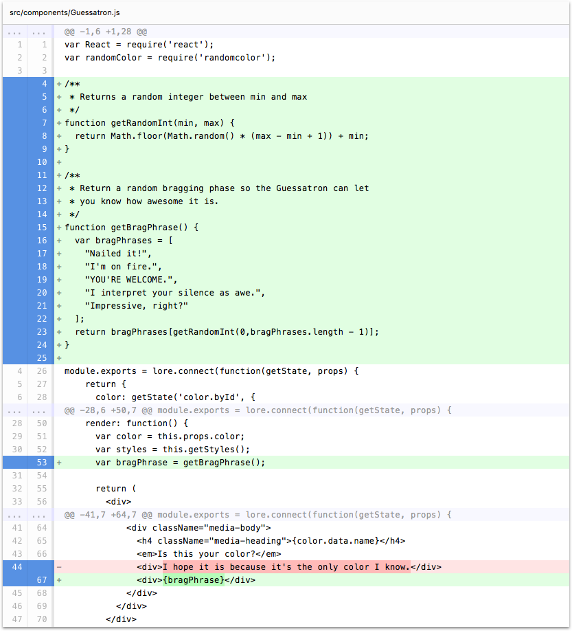

# Step 14: Speech AI

In this step we're going to give Guessatron the ability to tell you how awesome it is.

If you're using the CLI to follow along, you can complete this step by running the following command:

```sh
lore generate:tutorial step14
```

### Add the Language Dictionary

First we need to give Guessatron language skills and an extensive vocabulary to impress us with. Modify the top of 
`Guesstron` to include these two functions:

```js
// src/components/Guessatron.js
var React = require('react');
var randomColor = require('randomcolor');

/**
 * Returns a random integer between min and max
 */
function getRandomInt(min, max) {
  return Math.floor(Math.random() * (max - min + 1)) + min;
}

/**
 * Return a random bragging phase so the Guessatron can let
 * you know how awesome it is.
 */
function getBragPhrase() {
  var bragPhrases = [
    "I'm pretty sure I nailed it.",
    "Impressive right? Don't be shy. I know I'm awesome.",
    "YOU'RE WELCOME."
  ];
  return bragPhrases[getRandomInt(0,bragPhrases.length - 1)];
}

module.exports = lore.connect(function(getState, props) {
...
```

### Add the Speech AI

Now let's give Guessatron the ability to express what he's thinking.  For that, update the `render` function of 
`Guessatron` to get his most recent thought and display it on screen. We're going to replace the current hardcoded
thought `I hope it is because it's the only color I know.` with his most recent thought from `bragPhrase`.
 
```js
render: function() {
  ...
  var bragPhrase = getBragPhrase();

  return (
    ...
      <div className="media-body">
        <h4 className="media-heading">{color.data.name}</h4>
        <em>Is this your color?</em>
        <div>{bragPhrase}</div>
      </div>
    ...
  );
}
```

### Visual Check-in

If everything went well, your application should look like this. Now when you click on a color, Guessatron not only
displays a visual for that color buy also tells you how you should feel about him! So helpful.


## Code Changes

Below is a list of files modified during this step, as well as a visual diff to show you what was added or removed 
between this step and the last one.

### src/components/Guessatron.js





```js
var React = require('react');
var randomColor = require('randomcolor');

/**
 * Returns a random integer between min and max
 */
function getRandomInt(min, max) {
  return Math.floor(Math.random() * (max - min + 1)) + min;
}

/**
 * Return a random bragging phase so the Guessatron can let
 * you know how awesome it is.
 */
function getBragPhrase() {
  var bragPhrases = [
    "I'm pretty sure I nailed it.",
    "Impressive right? Don't be shy. I know I'm awesome.",
    "YOU'RE WELCOME."
  ];
  return bragPhrases[getRandomInt(0,bragPhrases.length - 1)];
}

module.exports = lore.connect(function(getState, props) {
    return {
      color: getState('color.byId', {
        id: props.params.colorId
      })
    }
  },
  React.createClass({
    displayName: 'Guessatron',

    propTypes: {
      color: React.PropTypes.object.isRequired
    },

    render: function() {
      var color = this.props.color;
      var generatedColor = randomColor();
      var bragPhrase = getBragPhrase();

      return (
        <div>
          <h2>Guessatron Result</h2>
          <div className="media">
            <div className="media-left">
              <a href="#">
                <div
                  className="media-object"
                  style={{height: '64px', width: '64px', backgroundColor: generatedColor}} />
              </a>
            </div>
            <div className="media-body">
              <h4 className="media-heading">{color.data.name}</h4>
              <em>Is this your color?</em>
              <div>{bragPhrase}</div>
            </div>
          </div>
        </div>
      );
    }
  })
);
```


## Next Steps

This step concludes Part 1 of the Tutorial. In Part 2, we'll cover editing and deleting data, as well as modal dialogs 
and displaying visual cues as to the state of data (being created, not found, etc).
