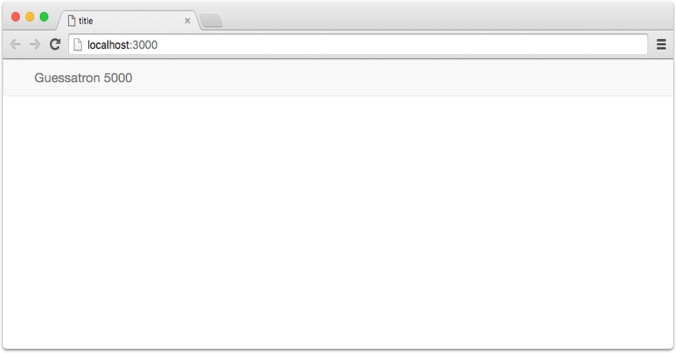
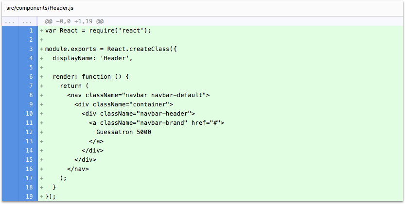

# Step 2: Adding a Header

In this step we're going to add a Header to our application, and learn about the `component` generator.

If you're using the CLI to follow along, you can complete this step by running the following command:

```sh
lore generate:tutorial step2
```

### Generate the Header Component

Instead of asking you to copy/paste some code for the Header, we're going to use CLI to generate the boilerplate for 
the component and modify it from there. Run the following command from the CLI:

```sh
lore generate:component Header
```

This will generate a component called `Header` and place it at `src/components/Header.js`. The component will look 
like this:
 
```js
var React = require('react');

module.exports = React.createClass({
  displayName: 'Header',

  propTypes: {},

  render: function () {
    return (
      <div></div>
    );
  }
});
```

Now granted, while that may not be very useful by itself (as you could have just copy/modified the `Layout` component), the 
generator is primarily meant to solve the problem of *creating* boilerplate during the initial app building stages. 

In addition to generating ES5 components (like the one above) you can also pass in a `--es6` flag to generate an ES6 
component, and there are additional flags for pre-configuring components for routing and connecting them to the data 
store.

You'll see more examples of using the component generator later in this tutorial, and you can also learn more
about it [in the CLI docs](../cli/GenerateComponent.md).

### Modify the Header Component

Now that we've created the skeleton for the Header component, modify the render function to look like this:

```js
// src/components/Header.js
...
  render: function () {
    return (
      <nav className="navbar navbar-default navbar-static-top">
        <div className="container">
          <div className="navbar-header">
            <a className="navbar-brand" href="#">
              Guessatron 5000
            </a>
          </div>
        </div>
      </nav>
    );
  }
...
```

### Add the Header to the Layout

Now we need to modify the output of the `Layout` component so the Header gets rendered to the browser. Update the render
function for the `Layout` component to look like this:

```js
// src/components/Layout.js
...
  render: function() {
    return (
      <div>
        <Header />
        <div className="container">
          <div className="row">
            <div className="col-md-4">
              {/* Color creator will go here */}
            </div>
            <div className="col-md-offset-1 col-md-7">
              {/* Guessatron's result will go here */}
            </div>
          </div>
        </div>
      </div>
    );
  }
...
```

### Visual Check-in

If everything went well, your application should now look like this.



## Code Changes

Below is a list of files modified during this step, as well as a visual diff to show you what was added or removed 
between this step and the last one.

### src/components/Header.js





```js
var React = require('react');

module.exports = React.createClass({
  displayName: 'Header',

  render: function () {
    return (
      <nav className="navbar navbar-default navbar-static-top">
        <div className="container">
          <div className="navbar-header">
            <a className="navbar-brand" href="#">
              Guessatron 5000
            </a>
          </div>
        </div>
      </nav>
    );
  }
});
```


### src/components/Layout.js





```js
var React = require('react');
var Header = require('./Header');

module.exports = React.createClass({
  displayName: 'Layout',

  render: function() {
    return (
      <div>
        <Header />
        <div className="container">
          <div className="row">
            <div className="col-md-4">
              {/* Color creator will go here */}
            </div>
            <div className="col-md-offset-1 col-md-7">
              {/* Guessatron's result will go here */}
            </div>
          </div>
        </div>
      </div>
    );
  }
});
```


## Next Steps

Next we're going to expand our app by [adding a component for creating colors](./Step3.md) to the left column.
