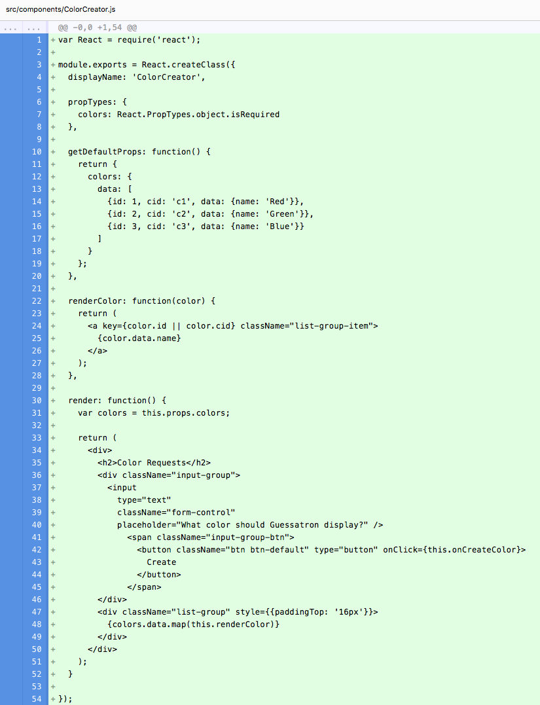
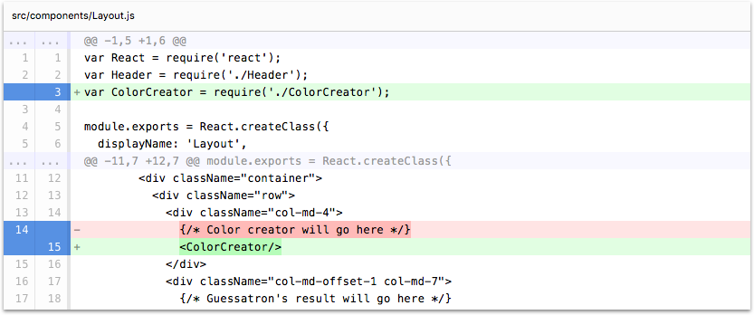

# Step 3: Mock out the ColorCreator

In this step, we're going to create a static representation of our ColorCreator component, and then refactor it in a
later step to connect it to a data source so we can create persistent data.

If you're using the CLI to follow along, you can complete this step by running the following command:

```sh
lore generate:tutorial step3
```

### Create the ColorCreator Component

Create a new component called `ColorCreator`, either by copy/pasting an existing component or through the CLI with the
command `lore generate:component ColorCreator`.  Modify the component to look like the following:

```js
// src/components/ColorCreator.js
var React = require('react');

module.exports = React.createClass({
  displayName: 'ColorCreator',

  propTypes: {
    colors: React.PropTypes.object.isRequired
  },

  getDefaultProps: function() {
    return {
      colors: {
        data: [
          {id: 1, data: {name: 'Red'}},
          {id: 2, data: {name: 'Green'}},
          {id: 3, data: {name: 'Blue'}}
        ]
      }
    };
  },

  renderColor: function(color) {
    return (
      <a key={color.id} className="list-group-item">
        {color.data.name}
      </a>
    );
  },

  render: function() {
    var colors = this.props.colors;

    return (
      <div>
        <h2>Color Requests</h2>
        <div className="input-group">
          <input
            type="text"
            className="form-control"
            placeholder="What color should Guessatron display?" />
              <span className="input-group-btn">
                <button className="btn btn-default" type="button">
                  Create
                </button>
              </span>
        </div>
        <div className="list-group" style={{paddingTop: '16px'}}>
          {colors.data.map(this.renderColor)}
        </div>
      </div>
    );
  }
});
```

The component should be pretty straight forward if you're familiar with React. Since this component is responsible for
rendering a list of colors for the Guessatron to display, we're declaring `colors` as a required `propType`. However,
since this component isn't connected to the data store yet, we're going to hard-code some data inside `getDefaultProps`.

If the data structure for `colors` looks unnecessarily complex to you, there's good reason it looks this way. We'll 
touch on it more throughout the tutorial, and you can also learn more about it [on the doc page](../basics/DataStructure.md).

### Add ColorCreator to the Layout

Now we just need to render our `ColorCreator` component from the left column of the `Layout` component. Import the
`ColorCreator` component into `Layout` and modify the render function of `Layout` to look like this:

```js
// src/components/Layout.js
...
  render: function() {
    return (
      <div>
        <Header />
        <div className="container">
          <div className="row">
            <div className="col-md-4">
              <ColorCreator/>
            </div>
            <div className="col-md-offset-1 col-md-7">
              {/* Guessatron's result will go here */}
            </div>
          </div>
        </div>
      </div>
    );
  }
...
```

### Visual Check-in

If everything went well, your application should now look like this.


## Code Changes

Below is a list of files modified during this step, as well as a visual diff to show you what was added or removed 
between this step and the last one.

### src/components/ColorCreator.js





```js
var React = require('react');

module.exports = React.createClass({
  displayName: 'ColorCreator',

  propTypes: {
    colors: React.PropTypes.object.isRequired
  },

  getDefaultProps: function() {
    return {
      colors: {
        data: [
          {id: 1, data: {name: 'Red'}},
          {id: 2, data: {name: 'Green'}},
          {id: 3, data: {name: 'Blue'}}
        ]
      }
    };
  },

  renderColor: function(color) {
    return (
      <a key={color.id} className="list-group-item">
        {color.data.name}
      </a>
    );
  },

  render: function() {
    var colors = this.props.colors;

    return (
      <div>
        <h2>Color Requests</h2>
        <div className="input-group">
          <input
            type="text"
            className="form-control"
            placeholder="What color should Guessatron display?" />
              <span className="input-group-btn">
                <button className="btn btn-default" type="button">
                  Create
                </button>
              </span>
        </div>
        <div className="list-group" style={{paddingTop: '16px'}}>
          {colors.data.map(this.renderColor)}
        </div>
      </div>
    );
  }
});
```


### src/components/Layout.js





```js
var React = require('react');
var Header = require('./Header');
var ColorCreator = require('./ColorCreator');

module.exports = React.createClass({
  displayName: 'Layout',

  render: function() {
    return (
      <div>
        <Header />
        <div className="container">
          <div className="row">
            <div className="col-md-4">
              <ColorCreator/>
            </div>
            <div className="col-md-offset-1 col-md-7">
              {/* Guessatron's result will go here */}
            </div>
          </div>
        </div>
      </div>
    );
  }
});
```


## Next Steps

Next we're going to add some callbacks to our ColorCreator component so we can [store the user's input](./Step4.md).
