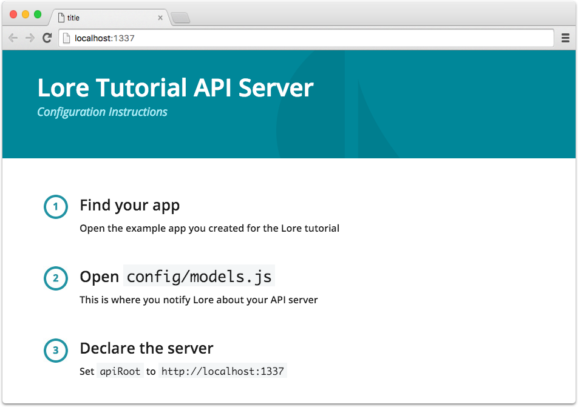

# Step 4.5: Installing the Tutorial Server

Since Lore is focused on promoting architecture and patterns that scale, we're not going to use local storage for this 
tutorial. Some tutorials that rely on it end up glossing over how server communication happens, and that can obstruct
the realism and believability of the experience. Instead, we're going to quickly generate an API server is 
pre-configured to support the needs of this tutorial.

> Currently, we *are* developing a local storage abstraction library for Lore that will emulate the server experience 
in the browser, so that you don't *have* to spin up a server for simple application development. Once an application
stops being trivial, having something that can emulate API calls becomes necessary for the continued refinement and 
development of the user experience. 

> While a service like [Apiary](https://apiary.io) can help prolong that need by providing a mock API, the fact that 
it doesn't actually create data or auto-generate new unique ids or support foreign key relationships means the utility 
it provides is limited.

> Once the localStorage abstraction library is ready we will update this tutorial to provide it as an alternative
option for proceeding forward.

### Generate the API Server

From the root of your project (or outside the project if you'd prefer) run the following command:

```sh
lore generate:tutorial server
```

This will create a new folder called `lore-tutorial-server` and place several files inside. These files make up a 
[Sails](https://github.com/balderdashy/sails) application, and is what we will be using to serve the API.

### Install Dependencies

Once the tutorial server is created, navigate into the directory and install it's dependencies.

```sh
cd lore-tutorial-server
npm install
```

### Start the Server

Once the dependencies are instaled, start the server by running:

```sh
npm start
```

By default, the server will start up on `localhost:1337`. If you need to change the port, you can do so by starting the
server through an alternative command, `node app.js --port=3001`.

If everything went well, you should see this when you navigate to `http://localhost:1337`:



### Tell Lore about the Server

Finally, you'll need to let Lore know where the API server can be found. For that, modify `config/models.js` and change
the default `apiRoot` from `https://api.example.com` to `http://localhost:1337`.

```js
// config/models.js

module.exports = {
  ...
  apiRoot: 'http://localhost:1337',
  ...
};
```

## Next Steps

Now that we've got a server we can persist data to, let's [create a model](./Step5.md) so we can use it.
