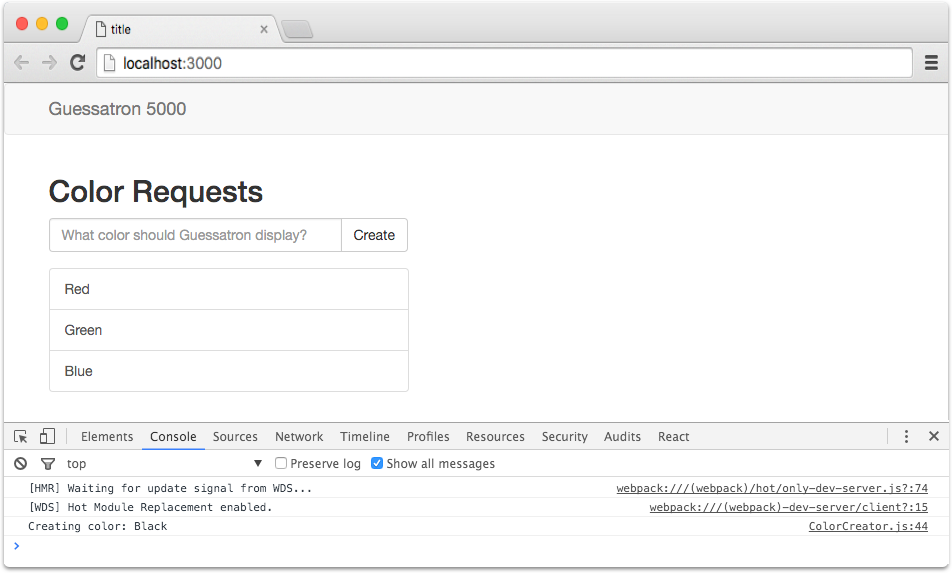
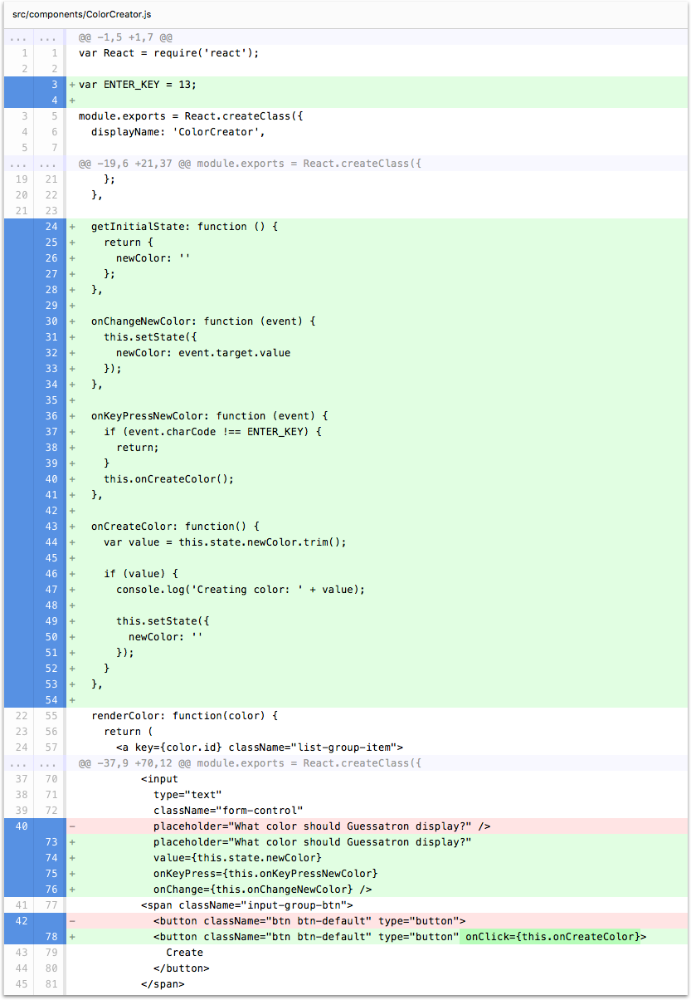

# Step 4: Add Input Callbacks to ColorCreator

In this step we're going to add some callbacks to our `<input>` element to keep track of the user's input in our 
ColorCreator component's state.

If you're using the CLI to follow along, you can complete this step by running the following command:

```sh
lore generate:tutorial step4
```

### Store User Input in Component State

For this step, we're first going to create a state variable called `newColor` to keep track of what the user types 
into the input element. Add a `getInitialState` function to our component to declare the variable, and use the value to
populate the input element. 

```js
// src/components/ColorCreator.js
...

module.exports = React.createClass({
  ...

  getInitialState: function () {
    return {
      newColor: ''
    };
  },

  ...

  render: function() {
    ...
    return (
        ...
          <input
            type="text"
            className="form-control"
            placeholder="What color should Guessatron display?"
            value={this.state.newColor} />
        ...
    );
  }
});
```

### Save State on Change

Next we want to update our state value as the user enters text, so that we can have it ready when we need to do 
something with the data. For that we're going to use the `onChange` callback of the `<input/>` element and update the
value of our `newColor` state as on changes.

```js
// src/components/ColorCreator.js
...

module.exports = React.createClass({
  ...

  onChangeNewColor: function (event) {
    this.setState({
      newColor: event.target.value
    });
  },

  ...

  render: function() {
        ...
          <input
            type="text"
            className="form-control"
            placeholder="What color should Guessatron display?"
            value={this.state.newColor}
            onChange={this.onChangeNewColor} />
        ...
    );
  }
});
```

### Reset State on Submit

Now that we're updating `newColor` as the value changes, let's attach a callback to the buttons `onClick` event so
that we can do something with the data. For now, we'll just log the value to the console.

```js
// src/components/ColorCreator.js
...

module.exports = React.createClass({
  ...

  onCreateColor: function() {
    var value = this.state.newColor.trim();

    if (value) {
      console.log('Creating color: ' + value);

      this.setState({
        newColor: ''
      });
    }
  },

  ...

  render: function() {
    ...
    return (
          ...
            <button className="btn btn-default" type="button" onClick={this.onCreateColor}>
              Create
            </button>
          ...
    );
  }
});
```

### Submit Data on Enter

Finally, we're also going to detect when the user presses the `Enter` key and use that as a trigger to submit the data
as well.  For that, we're going to tab into the `onKeyPress` event of the `<input/>` element.

```js
// src/components/ColorCreator.js
...
var ENTER_KEY = 13;

module.exports = React.createClass({
  ...

  onKeyPressNewColor: function (event) {
    if (event.charCode !== ENTER_KEY) {
      return;
    }
    this.onCreateColor();
  },

  ...

  render: function() {
    ...
    return (
        ...
          <input
            type="text"
            className="form-control"
            placeholder="What color should Guessatron display?"
            value={this.state.newColor}
            onKeyPress={this.onKeyPressNewColor}
            onChange={this.onChangeNewColor} />
        ...
    );
  }
});
```

### Visual Check-in

If everything went well, your application should now look like this. Identical to before : ) But now, if you enter text
into the input field and press `Enter` or click the `Create` button, the text should disappear and the value will be
logged to the console.



## Code Changes

Below is a list of files modified during this step, as well as a visual diff to show you what was added or removed 
between this step and the last one.

### src/components/ColorCreator.js





```js
var React = require('react');

var ENTER_KEY = 13;

module.exports = React.createClass({
  displayName: 'ColorCreator',

  propTypes: {
    colors: React.PropTypes.object.isRequired
  },

  getDefaultProps: function() {
    return {
      colors: {
        data: [
          {id: 1, data: {name: 'Red'}},
          {id: 2, data: {name: 'Green'}},
          {id: 3, data: {name: 'Blue'}}
        ]
      }
    };
  },

  getInitialState: function () {
    return {
      newColor: ''
    };
  },

  onChangeNewColor: function (event) {
    this.setState({
      newColor: event.target.value
    });
  },

  onKeyPressNewColor: function (event) {
    if (event.charCode !== ENTER_KEY) {
      return;
    }
    this.onCreateColor();
  },

  onCreateColor: function() {
    var value = this.state.newColor.trim();

    if (value) {
      console.log('Creating color: ' + value);

      this.setState({
        newColor: ''
      });
    }
  },

  renderColor: function(color) {
    return (
      <a key={color.id} className="list-group-item">
        {color.data.name}
      </a>
    );
  },

  render: function() {
    var colors = this.props.colors;

    return (
      <div>
        <h2>Color Requests</h2>
        <div className="input-group">
          <input
            type="text"
            className="form-control"
            placeholder="What color should Guessatron display?"
            value={this.state.newColor}
            onKeyPress={this.onKeyPressNewColor}
            onChange={this.onChangeNewColor} />
              <span className="input-group-btn">
                <button className="btn btn-default" type="button" onClick={this.onCreateColor}>
                  Create
                </button>
              </span>
        </div>
        <div className="list-group" style={{paddingTop: '16px'}}>
          {colors.data.map(this.renderColor)}
        </div>
      </div>
    );
  }
});
```


## Next Steps

Next we're going to add a Model to our application so that we can persistent data to the server. Once 
we do that we'll be able to create data for real. But first we're going to [generate an API server](./Step4-5.md) 
we can use to persist the data.
