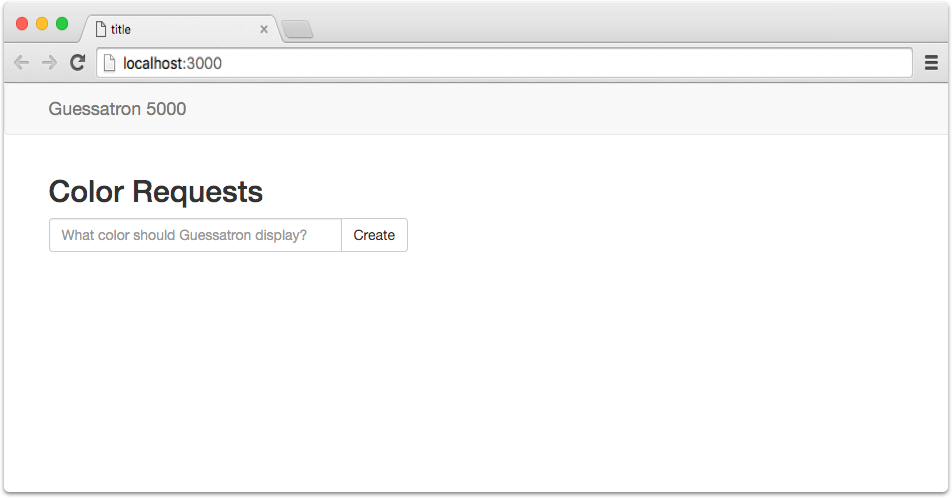
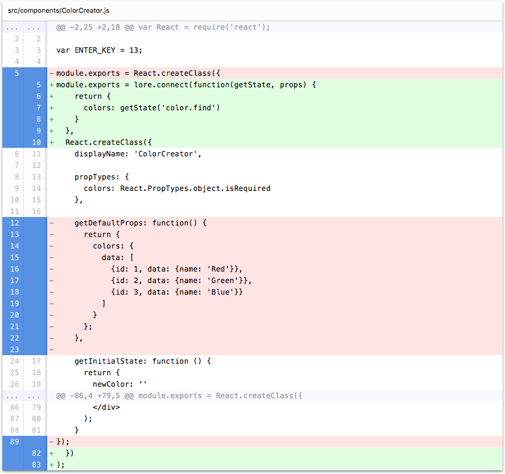

# Step6: Connecting Components

Alright, quick recap! So far we've created a `ColorCreator` component to capture user input, and a `Color` model that
represents a full set of actions and reducers for CRUD operations on that model. In may not look like it yet, but it's 
true : ) To start demonstrating that, we're going to connect our `ColorCreator` component to the data store, and start
populating it with real data.

If you're using the CLI to follow along, you can complete this step by running the following command:

```sh
lore generate:tutorial step6
```

### The Connect Decorator

Lore is designed around the concept of lazy-loading data. Components declare what data they want, and the framework
either gets it from the data store, or invokes whatever actions are necessary to obtain it from the server, and then
dispatches the result to the reducers once the data returns. The way that components declare what data they what is
through a decorator Lore provides called `connect`.

> If you're familiar with [react-redux](https://github.com/reactjs/react-redux) it's worth noting that the `connect` 
decorator in Lore is **not** the same as the `connect` decorator in `react-redux`. Lore's version is intentionally
dumber, and will **never** block the rendering cycle. If you're curious, you can learn more about 
[the reason for the difference](../basics/Connect.md).

To demonstrate the `connect` decorator, we're going to revisit the component generator, but this time we're going to
have it generate a component pre-configured to be connected to the data store. Run the following command:
 
```sh
lore generate:component ConnectMe --connect
```

Because decorators aren't very common in ES5 code, we're also going to show the ES6 version, which should look 
familiar-ish if you've ever used `react-redux`. And for fun, we're going to include the future ES7 version as well, 
because it's the easiest of the three to understand at a glance. The code generated should look like this:



```js
var React = require('react');

module.exports = lore.connect(function(getState, props) {
    return {
      //models: getState('model.find')
    }
  },
  React.createClass({
    displayName: 'ConnectMe',

    propTypes: {
      //models: React.PropTypes.object.isRequired
    },

    render: function () {
      return (
        <div></div>
      );
    }
  })
);
```

```js
import React, { Component, PropTypes } from 'react';

class ConnectMe extends Component {

  constructor(props) {
    super(props);
  }

  render() {
    return (
      <div></div>
    )
  }
}

ConnectMe.propTypes = {
  //models: React.PropTypes.object.isRequired
};

export default lore.connect((getState, props) => {
  return {
    //models: getState('model.find')
  };
}, ConnectMe);
```


```js
import React, { Component, PropTypes } from 'react';

@lore.connect((getState, props) => {
  return {
    //models: getState('model.find')
  };
})
export default class ConnectMe extends Component {

  static propTypes = {
    //models: React.PropTypes.object.isRequired
  };

  constructor(props) {
    super(props);
  }

  render() {
    return (
      <div></div>
    )
  }
}
```


See the `lore.connect` method wrapping the component?  That's the `connect` decorator. The first argument, `getState`, 
is a function that takes a request for data. It's basically the component's way of saying "I want this. Give it to me 
or go fetch it if you don't have it." The second argument is the `props` passed down from the parent component.

So now that we've covered the decorator, let's put it to use!

### Note about Accessing Lore

But first, since we haven't mentioned it yet, lore isn't just the name of the framework, but it's also the name of a 
global variable that gets added to `window` when application loads. If you take a look at the `index.js` file at the 
root of your application, it should look like this:

```js
// index.js
var lore = require('lore');

// Allows you to access your lore app globally as well as from within
// the console. Remove this line if you don't want to be able to do that.
window.lore = lore;

// Summon the app!
lore.summon();
```

It's important to mention that Lore itself is a singleton. Any component that requires lore through 
`var lore = require('lore')` receives the same instance as every other component. There is good and bad to this 
approach, and it may change overtime, but for now it was a conscious decision that the good outweighed the bad.

So while you may not be able to control whether lore is exposed as a singleton, you can control whether it's exposed 
as a global variable or not. If you don't want it to be, remove the `window.lore = lore` line, and then explicitly 
`require('lore')` in every file that needs it.

Also, it is fairly likely that as React's `context` becomes better understood, we will update the framework to make 
`lore` accessible through `context`, and recommend that approach over the others.

### Connect the ColorCreator Component

Alright! So now you know there's a global variable called `lore` and it contains the `connect` decorator as a 
property. So let's use it to connect our `ColorCreator` component to the data store.  Currently your `ColorCreator` 
component should look like this:

```js
// src/components/ColorCreator.js
var React = require('react');
var ENTER_KEY = 13;

module.exports = React.createClass({
  ...
  // the component's internal code
  ...
});
```

You'll want to take the existing declaration and replace it with this:

```js
// src/components/ColorCreator.js
var React = require('react');
var ENTER_KEY = 13;

module.exports = lore.connect(function(getState, props) {
    return {
      colors: getState('color.find')
    }
  },
  React.createClass({
    ...
    // the component's internal code
    ...
  })
);
```

Finally, now that the component is being provided `colors` from the data store, you can remove the `getDefaultProps`
function.

```js
// remove this function - we don't need it anymore
getDefaultProps: function() {
  return {
    colors: {
      data: [
        {id: 1, data: {name: 'Red'}},
        {id: 2, data: {name: 'Green'}},
        {id: 3, data: {name: 'Blue'}}
      ]
    }
  };
}
```

### Visual Check-in

Okay! Big step, a lot to absorb.  But it's over now! Refresh your browser and if everything went well, your application 
should look like this; same as before, but with no data. However if you open up the developer tools, you should a GET 
request go out to the API server to retrieve the list of colors.



### What just happened?

To explain what just happened, it will help to break down a few things.

First, if you open up the developer tools in the browser and look at the network requests, you'll see that a GET request 
went out to `http://localhost:1337/colors`. This url is a combination of the `apiRoot` property you set to `http://localhost:1337`
in `config/models.js`, the name of the model (color), and the fact that Lore defaults to a plural convention (which 
you can also change in `config/models.js`). Putting that all together, you get 
`apiRoot + modelName + pluralizeSetting = URL = http://localhost:1337/colors`.

So that explains how the URL was created, but not why it was a GET request. For that, we need to look at the `getState`
call in the `connect` decorator. For our `ColorCreator` component, that declaration was:

```js
lore.connect(function(getState, props) {
    return {
      colors: getState('color.find')
    }
  },
  ...
});
```

The `getState('color.find')` method is what we need to pay attention to. Essentially, the string argument is the piece
of state in the Store this component wants. When you created the `color` model, Lore in turn created a reducer called 
`color` with some child reducers. One of those child reducers is called `find`, and is responsible for keeping track
of all `color` data in application. It will also group the data by specific query requests (like all colors that start
with a given letter) but that's outside the scope of this tutorial. Another in-scope child reducer, which you'll see 
later in the tutorial when we add routing, is called `byId` and is helpful when you need to retrieve a piece of data
by its id.

So putting all of that together, the `getState('color.find')` call lets Lore know that you want to find (GET) all the 
colors, and the combination of the settings in `config/models.js` and the existence of `src/models/color.js` tells
Lore which URL it should ask for the data.

Now since we don't have any data yet, it's hard to tell whether the action-reducer flow is actually working, and whether
the component is being updated when the data comes back. But once we start creating data in the next step, it'll be
easier to see.

That's all for this step! Quite a doozey. Code changes below.

## Code Changes

Below is a list of files modified during this step, as well as a visual diff to show you what was added or removed 
between this step and the last one.

### src/components/ColorCreator.js





```js
var React = require('react');

var ENTER_KEY = 13;

module.exports = lore.connect(function(getState, props) {
    return {
      colors: getState('color.find')
    }
  },
  React.createClass({
    displayName: 'ColorCreator',

    propTypes: {
      colors: React.PropTypes.object.isRequired
    },

    getInitialState: function () {
      return {
        newColor: ''
      };
    },

    onChangeNewColor: function (event) {
      this.setState({
        newColor: event.target.value
      });
    },

    onKeyDownNewColor: function (event) {
      if (event.charCode !== ENTER_KEY) {
        return;
      }
      this.onCreateColor();
    },

    onCreateColor: function() {
      var value = this.state.newColor.trim();

      if (value) {
        console.log('Creating color: ' + value);

        this.setState({
          newColor: ''
        });
      }
    },

    renderColor: function(color) {
      return (
        <a key={color.id} className="list-group-item">
          {color.data.name}
        </a>
      );
    },

    render: function() {
      var colors = this.props.colors;

      return (
        <div>
          <h2>Color Requests</h2>
          <div className="input-group">
            <input
              type="text"
              className="form-control"
              placeholder="What color should Guessatron display?"
              value={this.state.newColor}
              onKeyPress={this.onKeyDownNewColor}
              onChange={this.onChangeNewColor} />
            <span className="input-group-btn">
              <button className="btn btn-default" type="button" onClick={this.onCreateColor}>
                Create
              </button>
            </span>
          </div>
          <div className="list-group" style={{paddingTop: '16px'}}>
            {colors.data.map(this.renderColor)}
          </div>
        </div>
      );
    }
  })
);
```


## Next Steps

Next we're going to show how to [emit actions from our components](./Step7.md) so we can create some real data.
