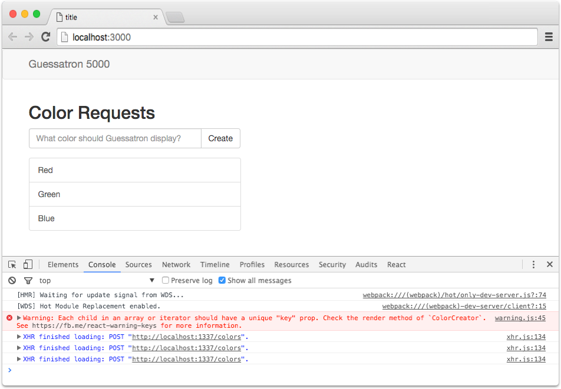
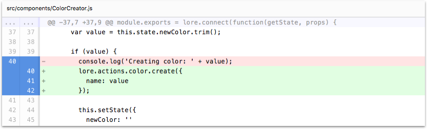

# Step 7: Creating Colors with Actions

In this step we'll learn how to create data using actions.

If you're using the CLI to follow along, you can complete this step by running the following command:

```sh
lore generate:tutorial step7
```

### Adding a Create Action

Currently when we try to create a color in our `ColorCreator` component, it gets logged to the console. This is our
current code:

```js
// src/components/ColorCreator.js

...
  onCreateColor: function() {
    var value = this.state.newColor.trim();
  
    if (value) {
      console.log('Creating color: ' + value);
  
      this.setState({
        newColor: ''
      });
    }
  },
...
```

Now we're going to replace the logging behavior with an actual create behavior. To do that, replace the `console.log` 
line with a call to `lore.actions.color.create`:

```js
// replace this
console.log('Creating color: ' + value);

// with this
lore.actions.color.create({
  name: value
});
```

Any actions you create in Lore, whether actions you create yourself or those created by the framework, are exposed on
`lore` using the pattern `lore.actions.[modelName].[action]`.  In this example, we want to *create* a *color*, so the
call pattern becomes `lore.actions.color.create`.  Lore also exposes actions for `update` and `destroy`, which we'll
cover later in the tutorial.

The argument for the `create` action is an object of attributes you want the color to be created with. In this example,
colors only have a name, so that's all we pass in.

That's it! Refresh the page, and try creating some colors. I'm going to create the colors Red, Green and Blue for 
the screenshot below. You should also note that as you create colors they do in fact show up in the list. This is
because the actions are dispatching information to reducers, which cause the Store to update, and the application
re-renders. It was hard to see in the previous step, but much easier to see now.

### Visual Check-in

If everything went well, your application should now look like this. If you open up the developer tools (and have 
`Log XMLHttpRequests` checked in Settings) you should see a POST request being sent out each time you submit a color.



## Code Changes

Below is a list of files modified during this step, as well as a visual diff to show you what was added or removed 
between this step and the last one.

### src/components/ColorCreator.js





```js
var React = require('react');

var ENTER_KEY = 13;

module.exports = lore.connect(function(getState, props) {
    return {
      colors: getState('color.find')
    }
  },
  React.createClass({
    displayName: 'ColorCreator',

    propTypes: {
      colors: React.PropTypes.object.isRequired
    },

    getInitialState: function () {
      return {
        newColor: ''
      };
    },

    onChangeNewColor: function (event) {
      this.setState({
        newColor: event.target.value
      });
    },

    onKeyDownNewColor: function (event) {
      if (event.charCode !== ENTER_KEY) {
        return;
      }
      this.onCreateColor();
    },

    onCreateColor: function() {
      var value = this.state.newColor.trim();

      if (value) {
        lore.actions.color.create({
          name: value
        });

        this.setState({
          newColor: ''
        });
      }
    },

    renderColor: function(color) {
      return (
        <a key={color.id} className="list-group-item">
          {color.data.name}
        </a>
      );
    },

    render: function() {
      var colors = this.props.colors;

      return (
        <div>
          <h2>Color Requests</h2>
          <div className="input-group">
            <input
              type="text"
              className="form-control"
              placeholder="What color should Guessatron display?"
              value={this.state.newColor}
              onKeyPress={this.onKeyDownNewColor}
              onChange={this.onChangeNewColor} />
            <span className="input-group-btn">
              <button className="btn btn-default" type="button" onClick={this.onCreateColor}>
                Create
              </button>
            </span>
          </div>
          <div className="list-group" style={{paddingTop: '16px'}}>
            {colors.data.map(this.renderColor)}
          </div>
        </div>
      );
    }
  })
);
```


## Next Steps

Next we're going to learn about the [client id (cid) field in Lore's data structure](./Step8.md), as a way to resolve 
a common React warning about duplicate component keys.
