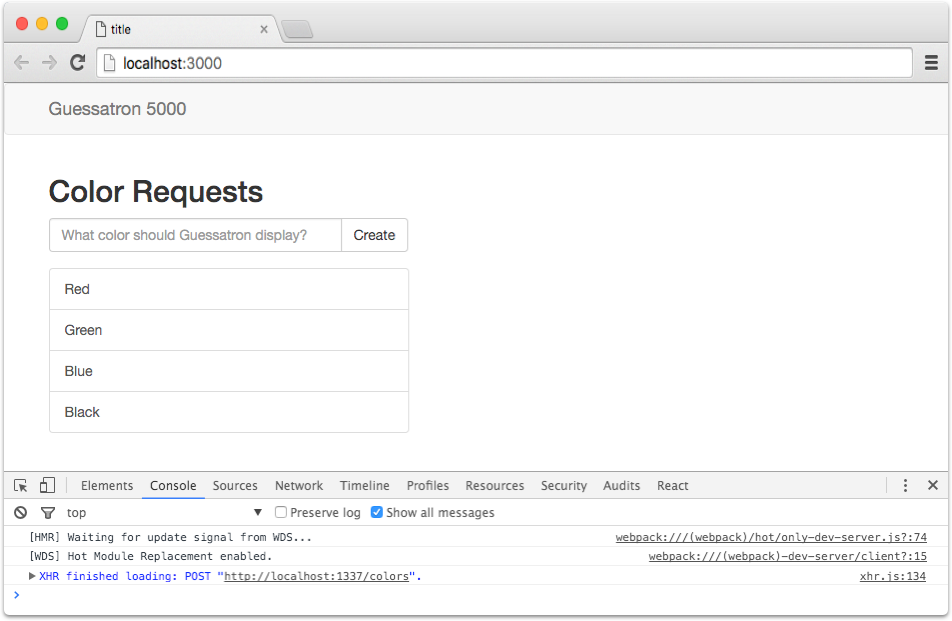
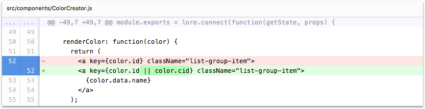

# Step 8: The Client Id (cid) Field

In this step we'll learn about one of the reasons for the client id (cid) field in Lore's data structure; removing 
React warnings about duplicate keys.

If you're using the CLI to follow along, you can complete this step by running the following command:

```sh
lore generate:tutorial step8
```

### React Warning

While our application appears to be working well, there is one small problem.  If you open up the console and create
a color, you should see a warning like this:


The reason for this warning is in the `renderColor` method of `ColorCreator`. Take a look at the `key` attribute, where
we assign it the value of `color.id`.

```js
// src/components/ColorCreator.js
renderColor: function(color) {
  return (
    <a key={color.id} className="list-group-item">
      {color.data.name}
    </a>
  );
},
```

The reason we're getting this warning is because when we first create a color, the color doesn't have an `id` until it 
comes back from the server. Lore defaults to optimistic behavior (actions are assumed to succeed), which means data 
will get rendered as soon as it's created. While you can [disable that behavior](../recipes/DisablingOptimisticBehavior.md)
if you want, it's not recommended as a general practice.

### Add cid as a Key

To resolve the error, we're going to make a very small change. Replace `key={color.id}` with 
`key={color.id || color.cid}`. Your `renderColor` method should now look like this:

```js
// src/components/ColorCreator.js
...
renderColor: function(color) {
  return (
    <a key={color.id || color.cid} className="list-group-item">
      {color.data.name}
    </a>
  );
},
...
```

That's it! Refresh your browser and create another color. The warning should no longer appear. 

### What's a cid?

A "Client Id", or cid, is a concept Lore borrowed from [Backbone.Model](http://backbonejs.org/#Model-cid). It's a 
unique id created *by the client* and follows the pattern `c1, c2, c3`, etc. So the first color you create will get a 
cid id of `c1`, the second color will get a cid of `c2`, and so on. The value will keep incrementing until you refresh 
the browser, and then it resets to `c1` again.

Cids are *extremely* important if your application follows an optimistic update pattern (data is displayed in the UI 
before being confirmed by the server). In Lore, when your data is sent to the `lore.actions.color.create` action 
creator, it gets a cid and then two things happen at essentially the same time:

1. An AJAX request gets sent to the API server.
2. An action is dispatched to the reducers, which will add the data to their state.

Once the request comes back from the server, a second action is emitted with the new data (that now contains an id).
Without the cid, the reducers would have no way of knowing that the data that just came back is the same data it already
has in the reducer state.  The `cid` is how it makes that association, and it makes sure your data stays properly in 
synced.

There's also use case that cids enable, which has to do with blocking a UI experience (like a wizard) until a 
*specific* piece of data has been confirmed by the server. Without cids, that use case is somewhere between painful, 
fragile and impossible.

### Visual Check-in

If everything went well, your application should now look like this, exactly the same. But now without console warnings!



## Code Changes

Below is a list of files modified during this step, as well as a visual diff to show you what was added or removed 
between this step and the last one.

### src/components/ColorCreator.js





```js
var React = require('react');

var ENTER_KEY = 13;

module.exports = lore.connect(function(getState, props) {
    return {
      colors: getState('color.find')
    }
  },
  React.createClass({
    displayName: 'ColorCreator',

    propTypes: {
      colors: React.PropTypes.object.isRequired
    },

    getInitialState: function () {
      return {
        newColor: ''
      };
    },

    onChangeNewColor: function (event) {
      this.setState({
        newColor: event.target.value
      });
    },

    onKeyDownNewColor: function (event) {
      if (event.charCode !== ENTER_KEY) {
        return;
      }
      this.onCreateColor();
    },

    onCreateColor: function() {
      var value = this.state.newColor.trim();

      if (value) {
        lore.actions.color.create({
          name: value
        });

        this.setState({
          newColor: ''
        });
      }
    },

    renderColor: function(color) {
      return (
        <a key={color.id || color.cid} className="list-group-item">
          {color.data.name}
        </a>
      );
    },

    render: function() {
      var colors = this.props.colors;

      return (
        <div>
          <h2>Color Requests</h2>
          <div className="input-group">
            <input
              type="text"
              className="form-control"
              placeholder="What color should Guessatron display?"
              value={this.state.newColor}
              onKeyPress={this.onKeyDownNewColor}
              onChange={this.onChangeNewColor} />
                <span className="input-group-btn">
                  <button className="btn btn-default" type="button" onClick={this.onCreateColor}>
                    Create
                  </button>
                </span>
          </div>
          <div className="list-group" style={{paddingTop: '16px'}}>
            {colors.data.map(this.renderColor)}
          </div>
        </div>
      );
    }
  })
);
```


## Next Steps

In the next step we're going to [refactor our ColorCreator component](./Step9.md) to prepare for integrating routing
into our application.
