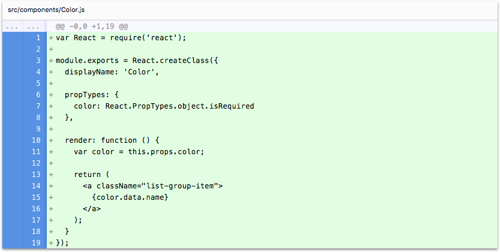
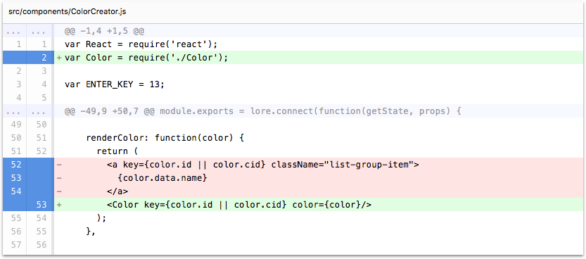

# Step 9: Refactor ColorCreator

In this step we're going to refactor our ColorCreator component to prepare for integrating routing into our application.

If you're using the CLI to follow along, you can complete this step by running the following command:

```sh
lore generate:tutorial step9
```

### Create the Color Component

Currently the `renderColor` method of our `ColorCreator` component looks like this:

```js
// src/components/ColorCreator.js
...
renderColor: function(color) {
  return (
    <a key={color.id || color.cid} className="list-group-item">
      {color.data.name}
    </a>
  );
},
...
```

To prepare to integrate routing into our application, and to set up the code better for steps later in the tutorial, 
we're going to break out the code that renders each color into its own components. Create a new component called 
`Color` either by copy/pasting or by running `lore generate:component Color`. Update the component to look like this:

```js
// src/components/Color.js
var React = require('react');

module.exports = React.createClass({
  displayName: 'Color',

  propTypes: {
    color: React.PropTypes.object.isRequired
  },

  render: function () {
    var color = this.props.color;

    return (
      <a className="list-group-item">
        {color.data.name}
      </a>
    );
  }
});
```

### Import the Color Component

Now that we've broken out our color rendering code into it's own component, let's use that in `ColorCreator`. Import
`Color` into `ColorCreator` and update the `renderColor` method to look like this:

```js
// src/components/ColorCreator.js
var Color = require('./Color');
...
renderColor: function(color) {
  return (
    <Color key={color.id || color.cid} color={color}/>
  );
},
...
```

### Visual Check-in

If everything went well, your application should now look like this. The same, but more organized!


## Code Changes

Below is a list of files modified during this step, as well as a visual diff to show you what was added or removed 
between this step and the last one.

### src/components/Color.js





```js
var React = require('react');

module.exports = React.createClass({
  displayName: 'Color',

  propTypes: {
    color: React.PropTypes.object.isRequired
  },

  render: function () {
    var color = this.props.color;

    return (
      <a className="list-group-item">
        {color.data.name}
      </a>
    );
  }
});
```


### src/components/ColorCreator.js





```js
var React = require('react');
var Color = require('./Color');

var ENTER_KEY = 13;

module.exports = lore.connect(function(getState, props) {
    return {
      colors: getState('color.find')
    }
  },
  React.createClass({
    displayName: 'ColorCreator',

    propTypes: {
      colors: React.PropTypes.object.isRequired
    },

    getInitialState: function () {
      return {
        newColor: ''
      };
    },

    onChangeNewColor: function (event) {
      this.setState({
        newColor: event.target.value
      });
    },

    onKeyDownNewColor: function (event) {
      if (event.charCode !== ENTER_KEY) {
        return;
      }
      this.onCreateColor();
    },

    onCreateColor: function() {
      var value = this.state.newColor.trim();

      if (value) {
        lore.actions.color.create({
          name: value
        });

        this.setState({
          newColor: ''
        });
      }
    },

    renderColor: function(color) {
      return (
        <Color key={color.id || color.cid} color={color}/>
      );
    },

    render: function() {
      var colors = this.props.colors;

      return (
        <div>
          <h2>Color Requests</h2>
          <div className="input-group">
            <input
              type="text"
              className="form-control"
              placeholder="What color should Guessatron display?"
              value={this.state.newColor}
              onKeyPress={this.onKeyDownNewColor}
              onChange={this.onChangeNewColor} />
            <span className="input-group-btn">
              <button className="btn btn-default" type="button" onClick={this.onCreateColor}>
                Create
              </button>
            </span>
          </div>
          <div className="list-group" style={{paddingTop: '16px'}}>
            {colors.data.map(this.renderColor)}
          </div>
        </div>
      );
    }
  })
);
```


## Next Steps

Next we're going to [integrate routing into our application](./Step10.md) so we can start asking the Guessatron 
to visualize some colors.
